# Project Advanced Lane Finding
---
## Overview of the Project
### Goal of the project

- Compute the camera calibration matrix and distortion coefficients given a set of chessboard images.
- Apply a distortion correction to raw images.
- Use color transforms, gradients, etc., to create a thresholded binary image.
- Apply a perspective transform to rectify binary image ("birds-eye view").
- Detect lane pixels and fit to find the lane boundary.
- Determine the curvature of the lane and vehicle position with respect to center.
Warp the detected lane boundaries back onto the original image.
- Output visual display of the lane boundaries and numerical estimation of lane curvature and vehicle position.

### Structure of my Project

#### Supporting Functions
In order to make the image processing look more straight-forward, I spent some weeks in creating my personal FeatureCollector class, which is stored under under the folder `cam_image_process/image_functions` to pipeline road images.

The details of the module package can be viewed in the [README.md](./cam_image_process/README.md) file.

#### Pipeline for Advanced Image Processing
Rendering the `image_functions` package, I built a pipeline named `lanes_detection_polyfit.py`, which cuts the whole procssing into 3 parts:
1. `container_initialization` that calculates the general parameters and initialize a container for storing images.
2. `window_lane_detector_initial` that uses the sliding window method for finding the lanes in the first image shot.
3. `window_lane_detector_sequential` that uses the detected curve parameters in the former image to detect the lane lines in the current image.

All parameters to be used are stored in the `parameters.py` and imported into the pipeline.

#### The video and images generating files

Respectively, the python file names are 

## Image Detection Step by Step
### 1. Camera Calibration and Image Undistortion
  Use the provided images, the camera calibration parameters are easily calculated using the `cv2.get_chessboard_calibraters()` function. One of the calibration results are shown as below:
  
  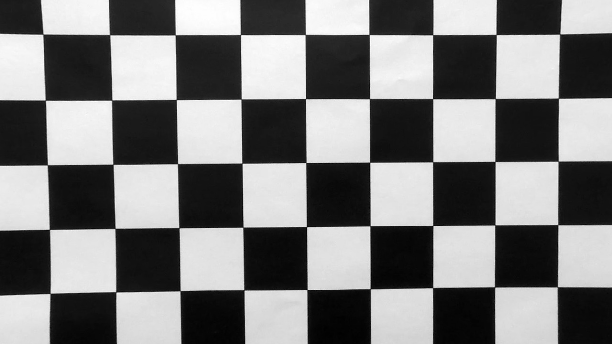
  
### 2. Perspective Transformation

  Through manually selecting 4 edge points on the undistorted image, as show below:
  
  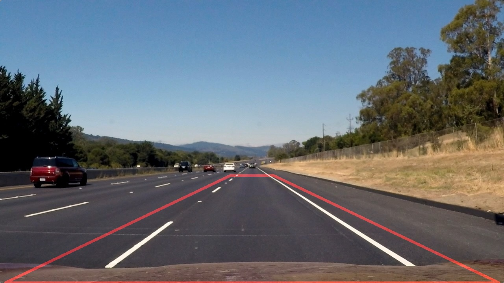
  
  I get the camera matrix for warping. But I'm not applying it to the image immediately, for the region near the vanishing point vagues a lot after warping:
  
  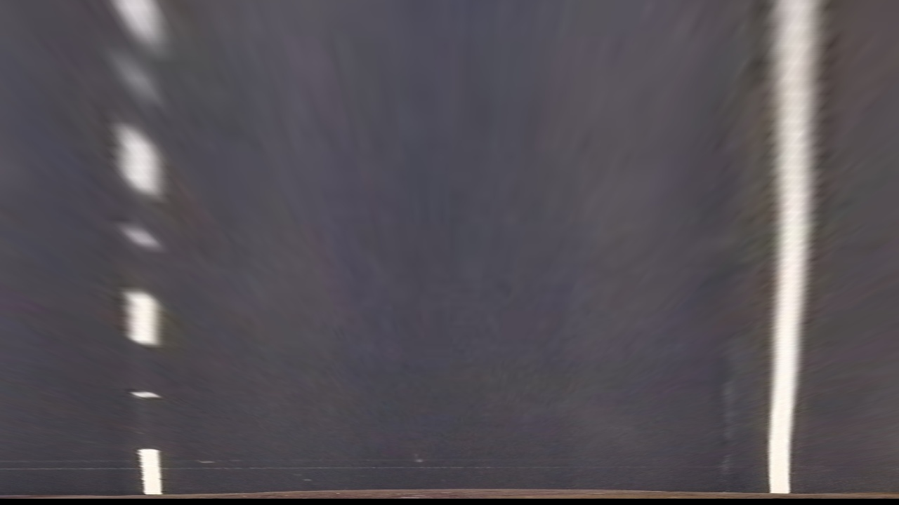
  
  which is not suitable for edge detection.
  
  
### 3. Create birds-eye viewed thresholded binary image
1. **Select Image Channels**
    
    As we have seen in the first project, improper selection of image channel may cause ambiguity. Thus the first step here is to find suitable channels to distinguish the lane lines from their surroundings to the greatest extent.
    
    I took the picture "test5.jpg", which contains a lot of shadowing as an example.
    
    

    **The R Channel**
    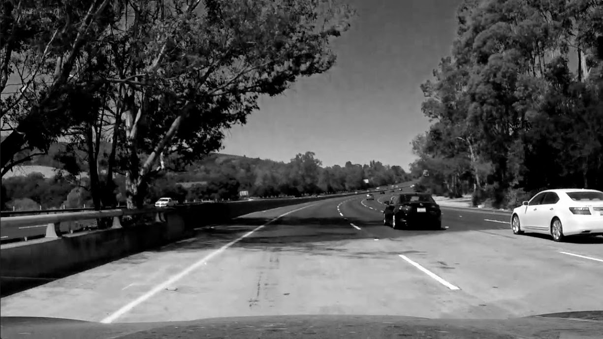
    
    **The S Channel**
    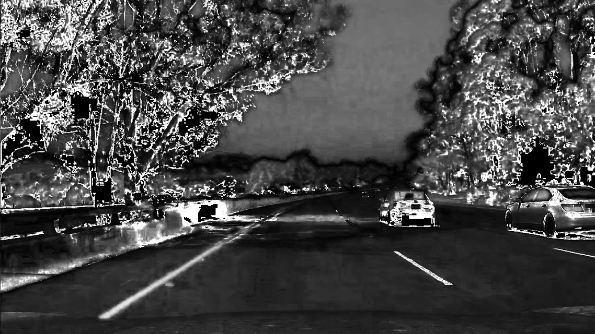
    
    I found out that the S channel might be the best choice in that it ignores a large amount of shadowing effect. However, the S channel also ignores some of the lane line subtles. On the other hand, the R channel make a perfect distinction between lane lines and the environment (because the yellow color contains a high value in R), but it cannot avoid the shadowing. It might be a good practice to combine the 2 channels together.
    
    After several experiments, I get the result as following:
    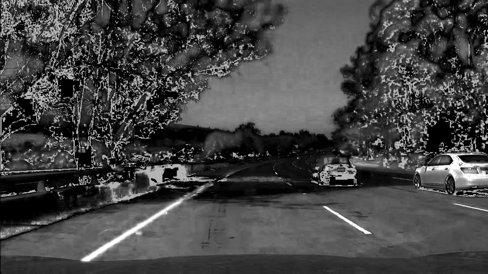
    
    THis picture would be the base for futher image transformations.
    
2. **Extract Edges in Picture**

    The basic idea is, extract the edges where the magnitude of gradient lays between 80 and 255, and the direction of gradient lays between π/5 and 2π/5(the lane).
    The extraction result is shown as below:
    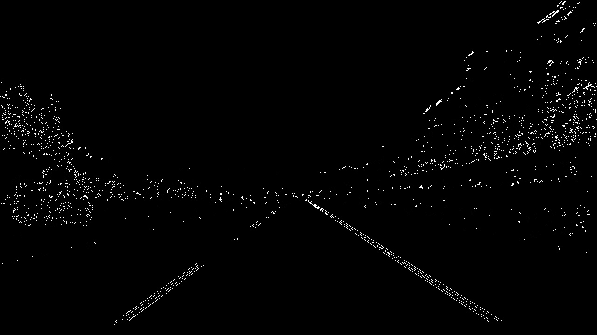

3. **Warping**
    
    After region constraining and warping, the binary image is shown as below:

    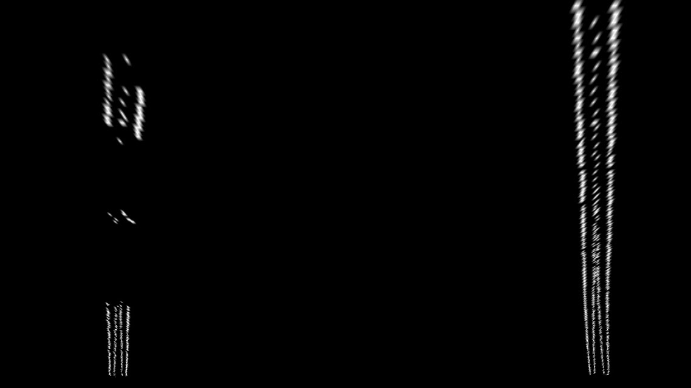
    
    which is ready for lane detection.
    
### 4. Lane Line Fitting Using Sliding Windows

1. **recognizing lane pixels**

    As suggested in the course, the initial step to find a lane is to use sliding windows. With number of windows set to 15, pixel margins set to 75, I get a pretty good result in recognizing lane line pixels:

    .jpg)
    
2. **Polynomial Regression on the data**

    Since different lane segments along the y axis have the same weight, I first reduce each detected lane into a single line:
    
    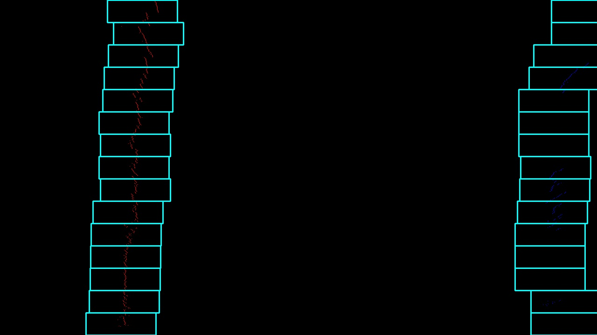
    
    Then apply the data points to the polyfit() function, I get the vectorized result:
    
    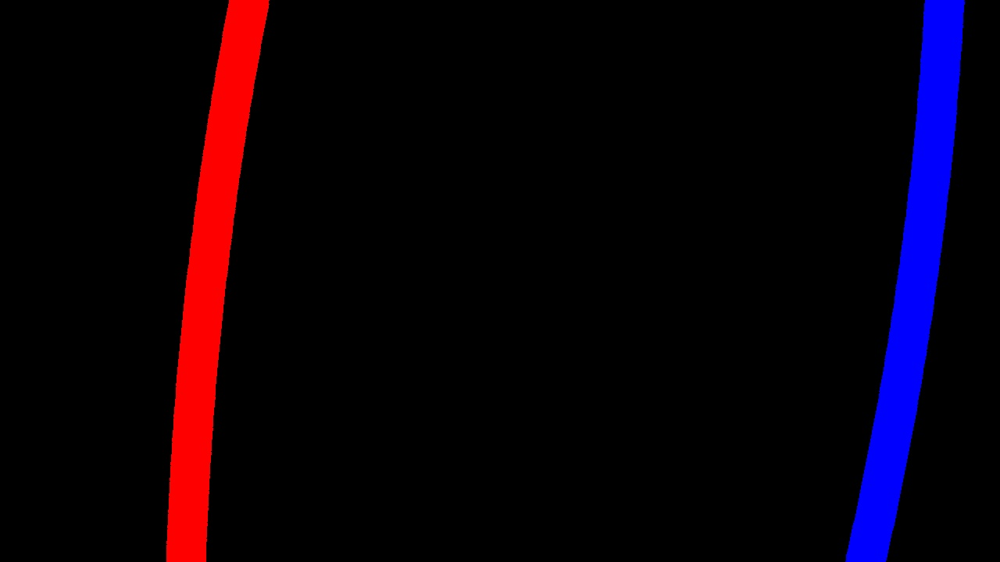

3. **Combine the detected result to the original image**
    
    Unwarp the above result and combine it to the original image, I get the detection result:
    
    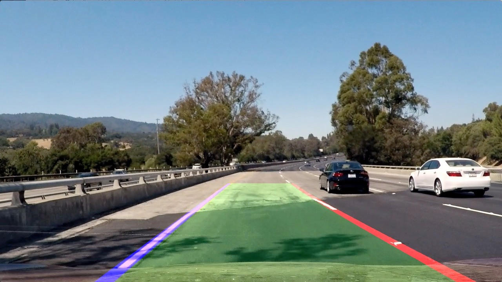

### 5. Lane Line Fitting Sequential

  Due to the fact that the lane lines won't change itself dramatically within short time, the sequential lane fitting can take advantage of the polynomial calculated beforehand. The only difference lies in that the "windows" are drawn in another manner, which I call a "serpent window":
    
  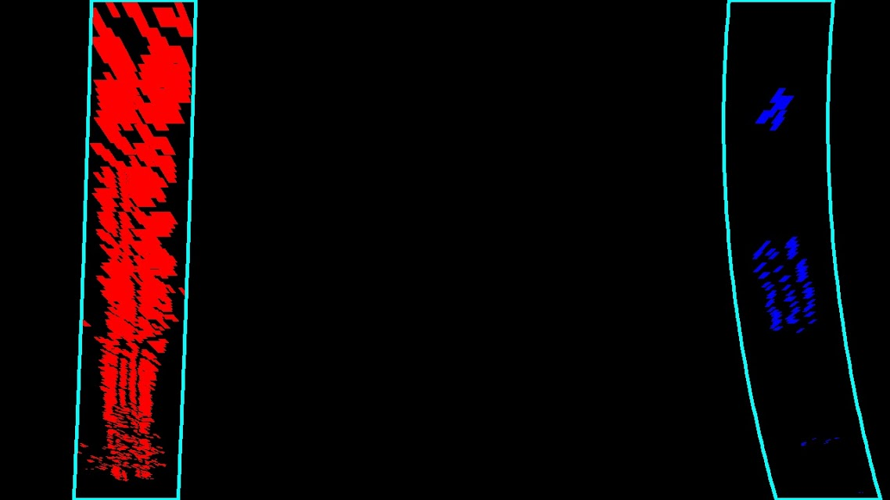
    
### 6. Calculate lane curvature and relative vehicle position
1. **Calculate the curvature of lane line**
2. **Calculate the relative lateral position of the ego-vehicle in lane**
3. **Add the information onto lane lines**

### 7. Output the result image

  After all the steps above, an example of the result image would look like this:
  
  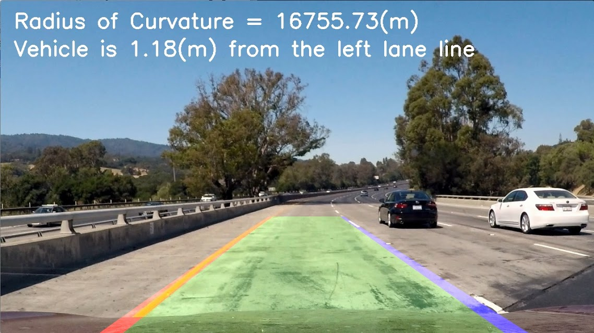
  
  which is awesome!
  
### 8. Lane line detection in video streaming

  I created the LaneFeatureCollector Class, which inheritates the FeatureCollector and can additionally store detection results.
  
  By editting the video clip by clip, I get the result videos in folder `output_images`. The `harder_challenge_video.mp4` is beyond me. I might try this later.

## Assessment on the result
### Detection Results

#### 1. Image Detection Results

The 6 test images, after processed with the sliding window method, provide a result as in the `output_images/test_output` folder

Among all, test1 doesn't provide a descent result, so I delved deeper into the pipeline.

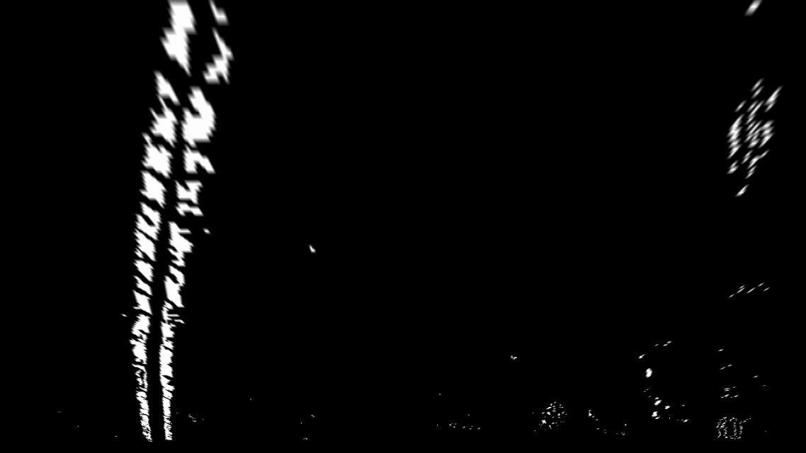

As shown above, there are a lot of "dirty points" which are hard to exclude during the window sliding process. However, if the sequential lane detection method is suggested, such problem would be deliminated. 

In conclusion, some images are not suitable as an "initial image", especially when there are a lot of noise in picture. But if doing sequentially, we could "smooth" the noise by taking advantage of the calculation results from former shots.

#### 2. Video Detection Results
I only applied my pipeline to the project video and challenge. The results are stored in the `output_videos` file as `processed_project_video.mp4` and `processed_challenge_video.mp4`.

As result, the project video works just perfect.
However, when it comes to the challenge, where multiple interferences come into practice, the result doesn't seem to perform as hoped. There are 3 problems that need to be solved:

1. During the shadowing region in the tunnel, the camera fails to acquire enough information. For this problem, I added some smoothing to the polynomial coefficients, which only solved part of the problem. If the shadowing is too long, however, I may suggest ultrared phtographing or even GPS service.
2. At the far ends of lane, the lines gets too vague that some segments cannot be detected anymore. This can be solved using some advanced machine learning techniques.
3. Some of the guardrails on the left side seem to be interacting with the detection of the left lane.

### Shortcomings

Apart from the 3 points covered in the processed_challenge_video part, there are actually a huge space of improvement. For example:

1. The time consumption is still too high for real-time calculation.(roughly 4 frame in a second, which is not enough for autonomous driving)
2. The driving condition has to be perfect to ensure a stablized shot.
3. In complex traffic conditions, such as on a mountain road, once the detector fails to detect the lane lines properly, the sequential detections would fail dramatically.
4. The canny edge detector is not enough to distinguish lane lines from other curves. Some more advanced CV techniques shall be suggested.

### Possible Improvements

1. Advanced machine learning techniques, like neural networks, might come into use in identifying lane lines and predict the trend of curve.
2. AI techniques, like hidden markov model might be suggested to improve the time smoothing effect.
3. The lane line detector might be combined with driving information of the ego-vehicle to make a better prediction.

In a word, the thing I have done is just to rudimentary to be concerned with any practical value, but the things I have learnt during the whole building process is just priceless.